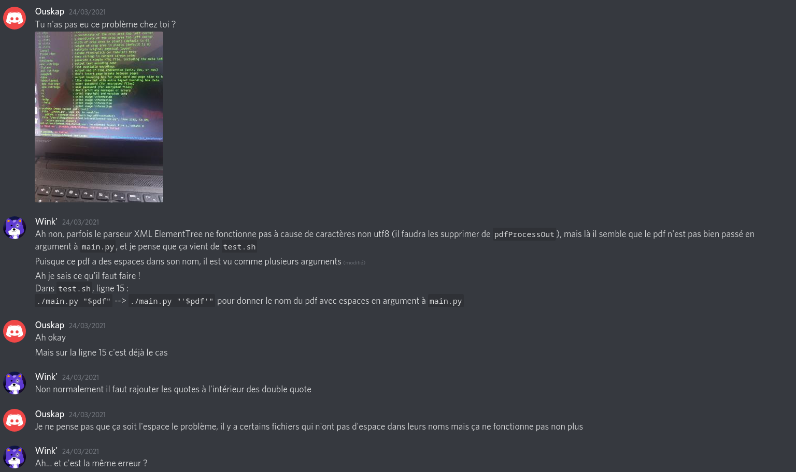

# Artefacts

This folder contains screenshots, ideas and prototypes we thought about while creating the parser.

## Communication

We use [discord](https://discord.com) to communicate on the project.
We mostly talk using messages, but we also meet using calls and the screen sharing feature.

## Project management

A github kanban board is available [here](https://github.com/sow35/Parser-for-scientific-paper/projects/1).
It allow us to create cards for "To Do" and "Fixes" that have to be made, and move them to "Done" when finished.

